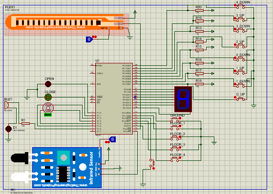

<center><h1><span style="color: lightblue ; ">Traffic Light Project </span> </h1></center> <br>

<h2><span style="color: pink ; ">Team 17 :</span></h2> 
<ul>
<li><span style="color: grey ; "> Mohammed Elsayed.</span></li>
<li><span style="color: grey ; "> Abdullah Drwesh.</span></li>
<li><span style="color: grey ; "> Esraa Sayed.</span></li>
<li><span style="color: grey ; "> Zeinab Walid.</span></li>
</ul>
<br>

<h2><span style="color: pink ; "> Introduction: </span></h2>
<p>
<span style="color: grey ; ">
&nbsp;&nbsp; We implement an Elevator system  that mimic the real system of elevators.
We use stepper motor that makes the elevator to move depending on given steps which are the 5 levels from ground till the fourth floor.
We use 7-Segment to display the location of the elevator in each floor.
We use two push buttons outside each floor except the ground and the last floor have one push button only to request the elevator to go up or down.
Also we use push buttons inside the elevator for the ground and the four floors.
We tried to express all scenario that could happen in real elevator system.
For example,the user can be in lower level and enter the elevator and press the fourth floor then another user enter from first floor and press the third floor, we save these requests and order them as to open in third floor first then the fourth one, not move to the fourth floor first then the third one which is not make sense and so on for other scenario that could happen in real elevator system.
Also, there is a push button to open the elevator if needed by user from inside.
The time of opening in each floor is five seconds except any one press the open button inside the elevator or someone stand infront of the door, we used IR sensor to sense the presence of anyone infront of the door in each time the door opens so if IR sensor detect someone infront of the door, the door still opens.
Moreover , We take overload issues into consideration for saftey so we determine the maximum number of passengers can be in the elevator is four and if the number of passengers exceed four the door still opens and an alarm starts.
We used Flex sensor to sense if the maximum weight is reached in the elevator or not in each time the door of elevator opens. If the maximum weight is reached the door of the elevator still open till someone exit from the elevator.

</span>
</p> 
<br>

<h2> <span style="color: pink ; "> Code: </span></h2>

<h3><span style="color: grey ; ">1- Initializations for registers & flags and pins.</span></h3>

```c
#include "c8051F020.h"

sbit ground = P3 ^0;
sbit floor1 = P3 ^1;
sbit floor2 = P3 ^5;
sbit floor3 = P3 ^3;
sbit floor4 = P3 ^4;

sbit ground_up = P0 ^7;
sbit floor1_down = P0 ^6;
sbit floor1_up = P0 ^5;
sbit floor2_down = P0 ^4;
sbit floor2_up = P0 ^3;
sbit floor3_down = P0 ^2;
sbit floor3_up = P0 ^1;
sbit floor4_down = P0 ^0;


sbit L3 = P1 ^2;
sbit L1 = P1 ^3;
sbit L2 = P1 ^4;
sbit L4 = P1 ^5;


sbit open_state = P1 ^0;
sbit close_state = P1 ^1;


sbit alarm_flex = P1^6;
sbit ir_sensor = P3^7;
sbit flex_sensor = P3^6;


unsigned short timer_count0 = 0;
unsigned short timer_count1 = 0;
char request_in[5] = {0, 0, 0, 0, 0}; //request in elevator
char request_out_up[5] = {0, 0, 0, 0, 0};
char request_out_down[5] = {0, 0, 0, 0, 0};
char orders_in[5] = {0, 0, 0, 0, 0};

unsigned char wait = 0; //if there is request in some floor
unsigned char f = 0;  // current floor number
unsigned char up = 0;
unsigned char down = 0;
unsigned char start = 1;
unsigned char move = 0;


```
<h3><span style="color: grey ; ">2- 7_Segmant output to represent floor number </span> </h3>

```c
void openLed(char index) {
    if (index == 0) {
        P2 = 0x3F;
    }
    if (index == 1) {
        P2 = 0x06;
    }
    if (index == 2) {

        P2 = 0x5B;
    }
    if (index == 3) {
        P2 = 0x4F;
    }
    if (index == 4) {
        P2 = 0x66;
   
 ```

 <h3><span style="color: grey ; ">3- Timer wating for 5 sec </span></h3> 

```c
void wait5s(int time) {

    while (timer_count1 != time) {
        TMOD |= 0x10;  //16-bit timer0 selected
        TH1 = 0xF8;   // Loading high byte in TH
        TL1 = 0xCC;   // Loaded low byte in TL
        TR1 = 1;      // Running the timer
        while (!TF1);   
        //Checking the timer flag register if it is not equal to 1
        TR1 = 0;      // If TF0=1 stop the timer
        TF1 = 0;     
         // Clear the Timer Flag bit for next calculation
        timer_count1++;
    }
}

```

<h3><span style="color: grey ; ">4- Handling user requests and control them.</span> </h3> 

```c
void get_request_in() {

    if (ground == 0) {
        request_in[0] = 1;
        increment(orders_in, 0);
    }
    if (floor1 == 0) {
        request_in[1] = 1;
        increment(orders_in, 1);
    }
    if (floor2 == 0) {
        request_in[2] = 1;
        increment(orders_in, 2);
    }
    if (floor3 == 0) {
        request_in[3] = 1;
        increment(orders_in, 3);
    }
    if (floor4 == 0) {
        request_in[4] = 1;
        increment(orders_in, 4);
    }
    if (ground_up == 0) {
        request_out_up[0] = 1;
        increment(orders_in, 0);
    }
    if (floor1_up == 0) {
        request_out_up[1] = 1;
        increment(orders_in, 1);
    }
    if (floor2_up == 0) {
        request_out_up[2] = 1;
        increment(orders_in, 2);
    }
    if (floor3_up == 0) {
        request_out_up[3] = 1;
        increment(orders_in, 2);
    }
    if (floor1_down == 0) {
        request_out_down[1] = 1;
        increment(orders_in, 1);
    }
    if (floor2_down == 0) {
        request_out_down[2] = 1;
        increment(orders_in, 2);
    }
    if (floor3_down == 0) {
        request_out_down[3] = 1;
        increment(orders_in, 1);
    }
    if (floor4_down == 0) {
        request_out_down[4] = 1;
        increment(orders_in, 2);
    }

}

char get_first_request() {
    char i = 0;
    for (i = 0; i < 5; i++) {
        if (orders_in[i] == 1)
            return i;
    }
    return 5;

}


char get_next_request(char direction, char begin_index) {
    if (direction == 1) {
        for (begin_index; begin_index < 5; begin_index++) {
            if (orders_in[begin_index] != 0) {
                return 1;
            }
        }
        return 0;
    } else if (direction == 0) {
        for (begin_index; begin_index >= 0; begin_index--) {
            if (orders_in[begin_index] != 0) {
                return 1;
            }
        }
        return 0;
    }
}


unsigned char check_request() {
    char i = 0;
    for (i = 0; i < 5; i++) {
        if (request_in[i] == 1)
            return 1;
        if (request_out_down[i] == 1)
            return 1;
        if (request_out_up[i] == 1) {
            return 1;
        }

    }
    return 0;
}

```

<h3><span style="color: grey ; ">5- Handling the order in the array orders_in to manage requests.</span>  </h3> 

```c
void increment(char arr[], char index) {
    char i = 0;
    arr[index] = 1;
    for (i = 0; i < 5; i++) {
        if (i != index)
            arr[index] += arr[i];
    }
    
}


void delete_order(char index) {
    orders_in[index] = 0;
}
```
<h3><span style="color: grey ; ">6- Stepper motor handling in two directions.</span></h3> 

```c
void motor(char count) {
    unsigned short i =0;
    switch (count){
        case 0:
            L4=1;
            L1=L2=L3=0;
            break;
        case 1:
            L3=1;
            L1=L2=L4=0;
            break;
        case 2:
            L2=1;
            L1=L3=L4=0;
            break;
        case 3:
            L1=1;
            L4=L2=L3=0;
            break;
        case 4:
            L4=1;
            L1=L2=L3=0;
            break;
    }
    for (i = 0; i < 16300 ; ++i);
}
```
<h3><span style="color: grey ; ">7- Timers interrupt that control the check request for each action of the user.</span></h3> 

```c
void Timer0(void) interrupt 1{

    if (timer_count0 < 10) {
        TR0 = 0;
        motor( timer_count0 % 5);
        TR1 = 1;
        timer_count0++;
    } else {
        TR0 = 0; //stop timer
        if (up)
            f++;
        if (down)
            f--;
        openLed(f);

        if (request_in[f] == 1) {
            wait = 1;
            request_in[f] = 0; //delete request
            delete_order(f);
            if (up) {
                if (request_out_up[f] == 1)
                    request_out_up[f] = 0;
                if (get_next_request(1, f)) {
                    down = 0;
                    up = 1;
                } else {
                    down = 1;
                    up = 0;
                }

            }
            if (down) {
                if (request_out_down[f] == 1)
                    request_out_down[f] = 0;
                if (get_next_request(0, f)) {
                    up = 0;
                    down = 1;
                } else {
                    up = 1;
                    down = 0;
                }
            }

        }
        if (up) {
            if (f == 4) {
                if (request_out_down[4] == 1) {
                    wait = 1;
                    request_out_down[4] = 0; //delete request
                    delete_order(4);
                }
            }
            if (request_out_up[f] == 1) {
                wait = 1;
                request_out_up[f] = 0; //delete request
                delete_order(f);
            }
            if (get_next_request(1, f)) {
                down = 0;
                up = 1;
            } else {
                down = 1;
                up = 0;
            }
        }
        if (down) {
            if (f == 0) {
                if (request_out_up[0] == 1) {
                    wait = 1;
                    request_out_up[0] = 0; //delete request
                    delete_order(0);
                }
            }
            if (request_out_down[f] == 1) {
                wait = 1;
                request_out_down[f] = 0; //delete request
                delete_order(f);
            }
            if (get_next_request(0, f)) {
                down = 1;
                up = 0;
            } else {
                down = 0;
                up = 1;
            }
        }
        timer_count0 = 0;
    }
}

void INT0(void) interrupt 0{
    if (wait == 1) {
        timer_count1 = 0;
    }
}
```
<h2> <span style="color: pink ; "> Schematic Circuit : </span></h2>

<h3><span style="color: grey ; ">Schematic view of Elevator System.</span></h3>


<br>


